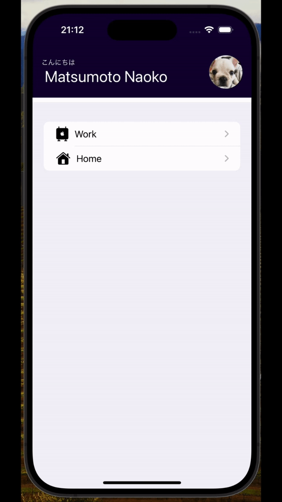

# Name : TodoApp

カテゴリーごとにタスクを管理できるiOSアプリです

# DEMO

# Features

シンプルで直感的な操作で、あなたのタスクを管理できます。

# Requirement

* Mac Book Pro
* Xcode 15.0.1
* Swift 5.9
* SwiftUI

# Installation

* 以下のリンク先からXcodeをインストール  
[Xcodeインストーラーのありか](https://apps.apple.com/jp/app/xcode/id497799835?mt=12)  
* ターミナルを開き、任意の階層で、リポジトリをクローンしてください。   
 "git@github.com:MATSUINAOKO/TodoApp_Polyglottal.git)"  
* 「Todo_App.xcodeproj」ファイルをダブルクリックすると、ファイルが開きます。    
* 画面左上にある ▶️ をクリックすると、シュミレーターが立ち上がります。  

# Overview

* 項目ごとにメモが書ける  
* 新規作成ができる  
* 削除できる  
* 修正できる  

# Note

今回のMVPでは最小限の機能のため、  
ユーザー名の変更などはコード上での修正が必要です。    

# Author

* 作成者　：　松井尚子
* 所属　：　BTC5期　

# License

"TodoApp" is under [MIT license](https://en.wikipedia.org/wiki/MIT_License).

