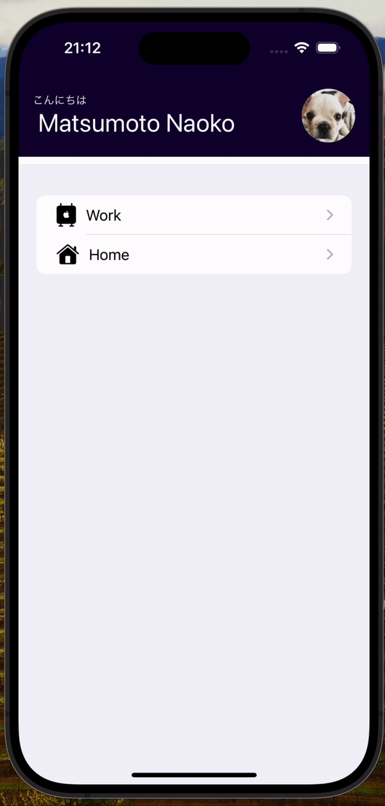

# Name : TodoApp

カテゴリーごとにタスクを管理できるiOSアプリです

# DEMO

# Features

シンプルで直感的な操作で、あなたのタスクを管理できます。

# Requirement

* Mac Book Pro
* Xcode 15.0.1
* Swift 5.9
* SwiftUI

# Overview

・項目ごとにメモが書ける
・新規作成ができる
・削除できる
・修正できる

# Note

今回のMVPでは最小限の機能のため、ユーザー名の変更などはコード上での修正が必要です。
また、アプリ内でのデータ保存のみとなっています。

# Author

* 作成者　：　松井尚子
* 所属　：　BTC5期　

# License

"TodoApp" is under [MIT license](https://en.wikipedia.org/wiki/MIT_License).

